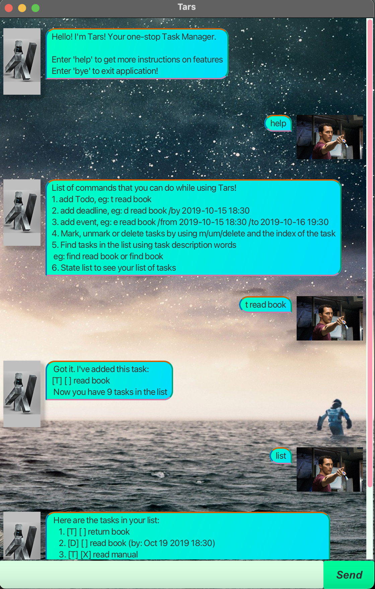

# Tars User Guide



Welcome to **Tars** chatbot application. Your one-stop Task manager.

TARS can handle 3 types of Tasks input!  
 - ToDo (simple tasks without any date or time information)
 - Deadline (a task that should be completed within a time)
 - Event (an event occurring from a particular start time to end time)

These tasks are then stored in a list. 

Besides adding these 3 task types you can also conduct other operations 
 - Mark the task as done, stating its index, eg: `m 2`
 - Unmark a task as not done,stating its index, eg: `um 2`
 - Delete a task from the list of tasks, stating its index, eg: `delete 2`
 - Find a task based on the name of the task, eg: `find read book`


## Adding ToDos
Adding a ToDos Task, eg: `t finish assignment`

This is how TARS would reply after adding the todo!
```
Got it. I've added this task: 
[T] [ ] finish assignment
Now you have 4 tasks in the list.
```

## Adding Deadline

Add a Deadline Task, stating the date and time in (YYYY-MM-DD HH:TT)

Example: `d read book /by 2019-10-15 18:30`

This is how TARS would reply after adding the deadline!: 
```
Got it. I've added this task: 
[D] [ ] read book (by: Oct 15 2019 18:30)
Now you have 4 tasks in the list.
```

## Adding Events

Add an Event Task, stating start and end of the event. 
Format for stating the date and time is (YYYY-MM-DD HH:TT)

Example: `e group meeting /from 2019-10-15 18:30 /to 2019-10-15 20:00`

This is how TARS would reply after adding the event!:
```
Got it. I've added this task: 
[E] [ ] read book (from: Oct 15 2019 18:30 to: Oct 15 2019 20:00)
Now you have 4 tasks in the list.
```

## Printing List

Access all the tasks added to your list by entering `list`

Example: `list`

This is how TARS would reply!:
```
Here are the tasks in your list:
1. [T] [ ] finish assignment
2. [D] [ ] read book (by: Oct 15 2019 18:30)
3. [E] [ ] read book (from: Oct 15 2019 18:30 to: Oct 15 2019 20:00)
```


## Deleting Task
Delete a task from the list by stating `delete` and the index of the task from the list

Example: `d 2` would delete the 2nd task in the list.

## Finding task 
Find a task from the list by searching with a keyword 

Example: `find read book` 
This will print all the tasks that has the keyword "book" in it.
This is how TARS would reply!:
```
Here are the matching tasks in your list:
1. [D] [ ] read book (by: Oct 15 2019 18:30)
2. [E] [ ] read book (from: Oct 15 2019 18:30 to: Oct 15 2019 20:00)
```

## Mark tasks
All tasks are default unmarked. Mark a task as **completed** using the index of the task. 

Example: `m 2`. This will mark the 2nd Task in the list.

This is how TARS would reply after adding the event!:
```
Nice! I've marked this task as done:[T] [X] read book 
```

## Unmark Task
Un mark a mark tasked using the index of the task, if the task is incomplete.

Example: `um 2`. This will mark the 2nd Task in the list.

This is how TARS would reply after adding the event!:
```
OK, I've marked this task as not done yet:[T] [] read book 
```

# Command Summary 

| Feature Type | Command          |
|--------------|------------------|
| list         | `list`           |
| Mark         | `m 2`            |
| Umark        | `um 2`           |
| Delete       | `delete 2`       |
| Find         | `find read book` |

